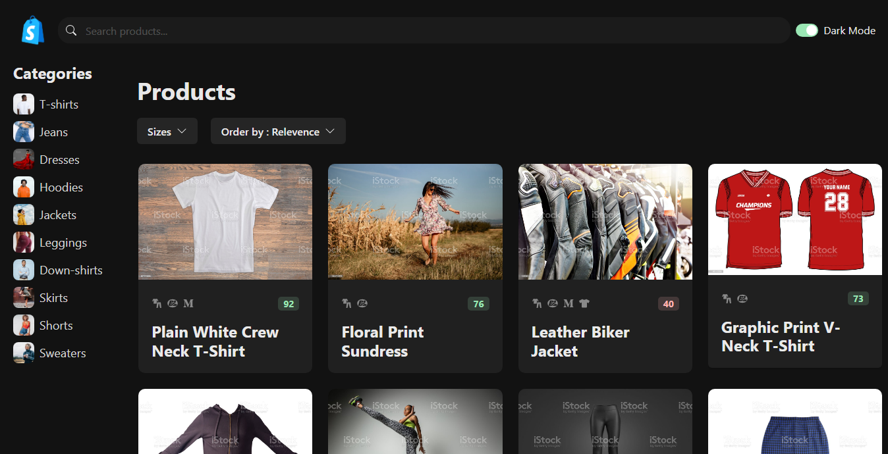

# Shopify

Shopify is a full-stack e-commerce web application built using React 18. It provides users with an intuitive interface to browse and explore a wide range of clothing brands, each with various products and sizes.

## Deployment

Shopify is deployed and 24/7 live up and running in the internet. You can visit the app at :[https://shopify-1-dun.vercel.app/](https://shopify-1-dun.vercel.app/)

## Backend API

Backend of shopify is also deployed over the internet. You can access the backend API from the following URL : [https://store-qytl.onrender.com/store](https://store-qytl.onrender.com/store)

## API Endpoints

- `/products` - Retrieve a list of Products.
- `/categories` - Retrieve a list of cloth categories.
- `/sizes` - Retrieve a size of clothes.
